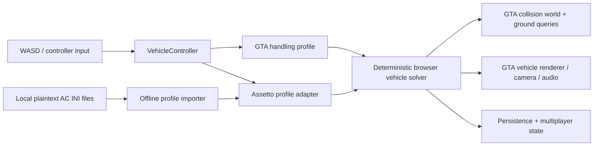

# GTA demo / Assetto Corsa driving integration

## Outcome

The demo exposes two selectable vehicle numerical modes:

| Mode | Current behavior | Intended role |
| --- | --- | --- |
| `gta` | Preserves the existing GTA handling values and solver path. | Open-world, arcade-style driving. |
| `assetto` | Uses a separate deterministic simulation profile with different steering, grip, braking, suspension, and power coefficients. | A local Assetto Corsa data-calibrated driving mode. |

The selector is in **Settings → Ped → Driving physics**. It persists in browser
settings and is included in the saved vehicle state. Switching keeps the vehicle
in place, clears lateral velocity, and damps yaw to avoid introducing an impulse.

## What this integration is—and is not

This project will implement its own browser physics backend. Assetto Corsa is a
separate native game and its executable cannot run inside this WebGL application.
We may derive numeric inputs from an authorized local copy's plaintext vehicle
and Nurburgring configuration files, but we will not add executables, decrypt or
unpack `data.acd`, evade DRM, or copy executable code, audio, or original
configuration text. Generated local profiles and scene packages are local demo
artifacts; they must remain scoped to installations for which the operator has
the required content rights.

This makes the promise precise: **Assetto Corsa profile-calibrated driving in the
GTA world**, not embedding or redistributing Assetto Corsa itself.

## Nordschleife visual extension

`/track` places the player at the Nordschleife extension.  It uses two separate
packages deliberately:

| Package | Current purpose |
| --- | --- |
| `road.nrb` | 6,899-segment, elevation-preserving drive ribbon. It is the active ground-contact/collision surface. |
| `scene/scene.json` + `*.tnm.gz` | Full static visual environment, streamed sector-by-sector after the playable road has loaded. It is visual-only for now. |

The local compiler [assetto_nurburgring_scene_compiler.py](/K:/webglgta/webgl/tools/assetto_nurburgring_scene_compiler.py)
reads the static entries from `models_nordschleife.ini`, applies the exact
AI-road origin/placement transform, clusters geometry on a 1 m grid, quantizes
positions to 16-bit coordinates, replaces source materials with a generated
small palette, and gzip-compresses each sector.  The resulting scene has 11
static sectors, 1,676,441 clustered vertices, 3,272,070 triangles, and a
15.9 MB compressed transfer size.  It is rendered asynchronously so circuit
visual loading cannot block driving input.

This is intentionally not full-world collision yet.  The road ribbon is the
only initial authoritative collision surface.  The next track phase is to
classify and selectively add barriers, walls, kerbs, pits, and off-track
surfaces from the same local source as separate collision layers; do not make
the coarse visual proxy authoritative for vehicle contact.

## Current architecture



The important boundary is `vehicle_physics_modes.js`. GTA mode returns the
authored `handling` object unchanged; the Assetto mode produces a distinct
`assettoHandling` coefficient set. When `assets/physics/assetto-corsa/<gta-model>.json`
exists during local development, `VehicleController` loads it automatically for
that model. Rendering, collision, audio, camera, ped seating, persistence, and
multiplayer remain shared.

## Local profile intake

The optional importer is [assetto_corsa_profile_import.py](/K:/webglgta/webgl/tools/assetto_corsa_profile_import.py).

It takes only paths explicitly supplied by the developer, reads the supported
plaintext INI files, and writes a derived JSON profile. For a local Nurburgring
installation whose track folder is named `ks_nordschleife`:

```powershell
python tools/assetto_corsa_profile_import.py `
  --car-id my_car `
  --car-data "D:\\SteamLibrary\\steamapps\\common\\assettocorsa\\content\\cars\\my_car\\data" `
  --track-id ks_nordschleife `
  --track-data "D:\\SteamLibrary\\steamapps\\common\\assettocorsa\\content\\tracks\\ks_nordschleife\\data" `
  --out webgl_viewer/assets/physics/assetto-corsa/my_car.json
```

Supported source fields are deliberately limited to derived numeric properties:
mass and inertia, drivetrain and differential ratios, limiter/shift timing,
brake balance, wheelbase/CG/tracks, active tyre radius/peak grip/load response,
suspension/anti-roll rates, numeric engine and coast torque curves, and track
surface friction. A packed `data.acd` is intentionally rejected; supply an
authorized plaintext `data/` folder if one is available.

## Data contract

The generated local profile has this stable shape:

```json
{
  "schema": "webglgta-assetto-corsa-profile-v1",
  "source": { "kind": "local_plaintext_ini", "carId": "my_car", "trackId": "ks_nordschleife" },
  "assettoHandling": { "mass": 1230, "gears": 6, "redlineRpm": 7200, "brakeBiasFront": 0.62 },
  "trackSurfaces": [{ "name": "asphalt", "friction": 0.98 }]
}
```

`assettoHandling` is a derived canonical schema, not a copy of original INI
content. It must be associated with a GTA-rendered vehicle through an explicit
developer-owned mapping; no Assetto vehicle asset is loaded by the demo.

## Delivery phases

1. **Complete now — mode seam, local binding, and baseline.** GTA and
   Assetto-profile modes are selectable, persistent, deterministic, and
   visibly/numerically distinct. A local profile named after the GTA model is
   loaded automatically in local development; production bundles omit it.
2. **Solver fidelity — implemented baseline.** Assetto mode now selects an
   independent fixed 120 Hz four-wheel backend. It owns wheel angular speed,
   tyre longitudinal/lateral slip with a friction ellipse, load sensitivity,
   per-axle suspension inputs, engine torque/engine-braking curves, gear and
   final-drive ratios, clutch shift interruption, brake bias, ABS-style wheel
   release, and traction-control torque reduction. GTA mode retains its prior
   60 Hz handling path and is never routed through this backend.
3. **Nurburgring surface calibration.** Map Nurburgring surface identifiers to
   the GTA collision material layer. The full local visual scene is now
   separately streamed; the road ribbon remains the collidable layer until
   classified circuit collision is exported.
4. **Validation and multiplayer.** Create repeatable acceleration, braking,
   skidpad, and lane-change telemetry tests; make the server authoritative or
   verify client simulation before competitive multiplayer.

## Acceptance checks

- Switching modes never changes vehicle position, ownership, or renderer asset.
- GTA mode's handling object is unmodified by the adapter.
- Assetto mode has measurable differences in steering lock, tire peak, braking,
  drive force, and suspension response.
- A missing local profile remains usable through the explicit baseline and is
  labeled as such in Settings.
- No generated profile is committed or included in a production deployment.
- Before claiming parity, compare telemetry—not feel alone—against a disclosed
  test car, tires, setup, weather, and reference run.

## Parity telemetry

The browser exposes an opt-in recorder at `window.__viewerVehicleDiagnostics`.
Start a run with `__viewerVehicleDiagnostics.start('braking-100-0')`, drive the
prescribed manoeuvre, then call `__viewerVehicleDiagnostics.stop()` and
`__viewerVehicleDiagnostics.snapshot()` to export the JSON capture.

Each fixed physics step records input; world pose; local/world/vertical velocity;
RPM, gear and shift timing; longitudinal/lateral/yaw acceleration; drive, brake,
drag and tire forces; normal loads and slip angles; material/grip; every wheel's
contact/compression; and collision/damage events. Capture metadata fingerprints
the selected physics mode, vehicle, local profile source, and effective handling
coefficients. A parity claim requires matching the reference vehicle, tires,
setup, weather, assists, controller, test surface, and prescribed manoeuvre.

## Assetto solver status and remaining parity work

The prior Assetto mode was only a GTA bicycle-model coefficient adapter, which
is why it could not produce a functioning Assetto-style car. The current
implementation is [assetto_vehicle_solver.js](/K:/webglgta/webgl/webgl_viewer/js/gameplay/assetto_vehicle_solver.js)
and is exercised by acceleration, braking, and steering/yaw tests. It is a
working browser road-car solver, not a claim of bit-for-bit equivalence with
the native game.

The remaining work to make a defensible parity claim is calibration, not a
missing simulation path: choose a valid local car with a physically usable
torque LUT; capture controlled AC reference runs; tune tyre relaxation,
damper/travel, differential locking and assist thresholds; then compare the
browser's recorder output manoeuvre by manoeuvre. The traffic Prius profile is
kept usable through a conservative torque fallback because its available
plaintext torque LUT falls to zero above 2,000 RPM; it is unsuitable as a
parity reference vehicle.

For current local development, the GTA-rendered Sultan is explicitly paired
with the locally installed `streetcarpack_nissan_r32_gtr` profile as
`assets/physics/assetto-corsa/sultan.json`. That profile has 1,375 kg mass,
AWD2 normalized to a 50/50 drive baseline, 4.111 final drive, usable tyre and
suspension data, and a 1,000–8,000 RPM torque curve. It remains local-only and
is not a substitute for a licensed visual car asset.

The custom-vehicle catalog also already contains a complete rendered `350z`
entry. Its model key directly matches the local profile path
`assets/physics/assetto-corsa/350z.json`, generated from the authorized
plaintext data in `streetcarpack_nissan_350z/data`. This is the preferred
first calibration car: it is a 1,245 kg, rear-wheel-drive Z33 with six gears,
a 7,500 RPM limiter, and a continuous 0–7,500 RPM torque curve. The profile
is local-only; it calibrates the existing demo 350Z renderer and does not
import or distribute the Assetto Corsa vehicle mesh, textures, audio, or files.

## Existing-tool audit (17 August 2026)

`K:\WebGL_Tools` was compared read-only with
`peyton@192.168.0.85:/data/WebGL_Tools` (capitalization matters). The relevant
Assetto parser and Project Chrono vehicle bridge files have identical SHA-256
content in both locations, so no tool-tree synchronization was needed. Their
useful contribution is a reference for turning authorized plaintext data into
derived tuning values; the importer above now captures the core tyre,
suspension, drivetrain, and torque-curve values needed by a dedicated browser
solver.

The live service is instead at
`peyton@192.168.0.85:/data/NexusAI/webglgta-demo/`, not the similarly named
path initially supplied. It is a running, non-Git deployment whose vehicle code
layout differs from this development workspace. It must remain a deployment
target only after source review, build verification, backup, and explicit
approval; it is not a safe source to overwrite or merge automatically.

Project Chrono WASM remains an evaluated future backend, not a dependency of
the current browser demo. It would require a deliberate world-contact bridge,
vehicle-coordinate adapter, packaging review, and the same telemetry gates.
The current path keeps GTA collision/renderer integration intact while adding
the calibrated inputs necessary for the independent four-wheel solver.
